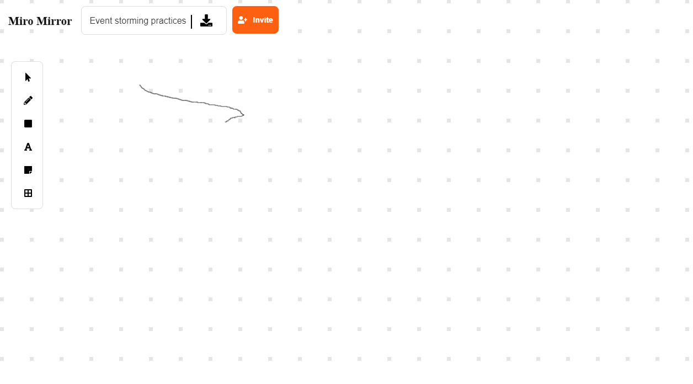

# Miro Mirror

* JavaScript
  * [JavaScript Canvas](https://developer.mozilla.org/zh-TW/docs/Web/API/Canvas_API)
  * [Konva.js](https://konvajs.org/)
  * [Fabric.js](http://fabricjs.com/)
* [Vue.js v3](https://v3.vuejs.org/)
  * [Vue Router](https://www.npmjs.com/package/vue-router)
  * [Fontawesome](https://fontawesome.com/)
    * [@fortawesome/fontawesome-svg-core](https://www.npmjs.com/package/@fortawesome/fontawesome-svg-core)
    * [@fortawesome/free-regular-svg-icons](https://www.npmjs.com/package/@fortawesome/free-regular-svg-icons)
    * [@fortawesome/free-solid-svg-icons](https://www.npmjs.com/package/@fortawesome/free-solid-svg-icons)
    * [@fortawesome/vue-fontawesome](https://www.npmjs.com/package/@fortawesome/vue-fontawesome)
  * [Fabric.js](http://fabricjs.com/)
    * [fabric](https://www.npmjs.com/package/fabric)
    * [@types/fabric](https://www.npmjs.com/package/@types/fabric)
  * [Konva.js](https://konvajs.org/)
    * [konva](https://www.npmjs.com/package/konva)
  * [mitt](https://www.npmjs.com/package/mitt) (impl EventBus)
  * [axios](https://www.npmjs.com/package/axios) (Promise based HTTP client for the browser and node.js)
  * [vue-axios](https://www.npmjs.com/package/vue-axios) (A small wrapper for integrating axios to Vuejs)

Development picture

 

 

